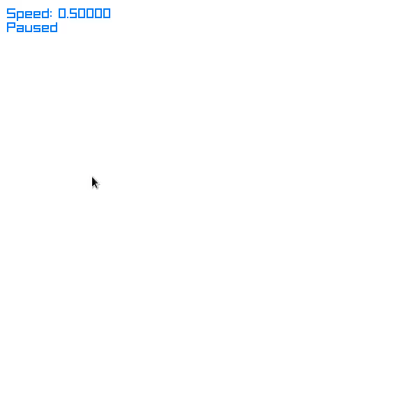

# game-of-life

Simple game using [raylib](https://github.com/raysan5/raylib)(Note: you have to build it on your own)

## Build
```console
$ make
$ ./gol
$ .\gol.exe # or if on Windows
```

## Controls
`LMB` - Put cell       \
`RMB` - Remove cell    \
`Space` - Pause/Resume \
`+`/`-` - Change speed \
`R` - Restart


